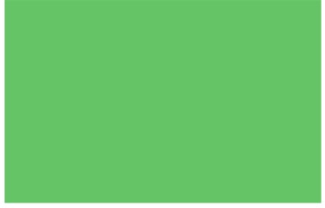
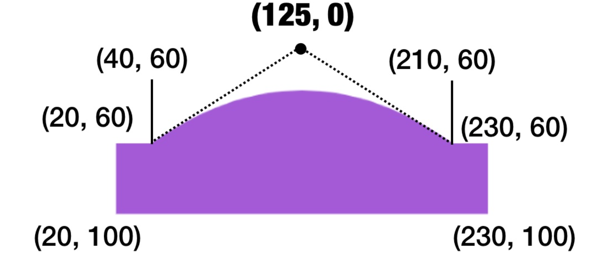

#Shapes Using Path



```swift 
struct PathView: View {
    var body: some View {
        VStack {
            Path { path in
                path.move(to: CGPoint(x: 20, y: 20))
                path.addLine(to: CGPoint(x: 300,y: 20))
                path.addLine(to:CGPoint(x: 300, y: 200))
                path.addLine(to: CGPoint(x: 20, y: 200))
            }.fill(.green)
        }
    }
}
```

Second Shape



```swift 
 Path {
                path in
                path.move(to: CGPoint(x: 20, y: 60))
                path.addLine(to: CGPoint(x: 40, y: 60))
                path.addQuadCurve(to: CGPoint(x: 210, y: 60), control: CGPoint(x: 125,y: 0))
                path.addLine(to: CGPoint(x: 230, y: 60))
                path.addLine(to: CGPoint(x: 230, y: 100))
                path.addLine(to: CGPoint(x: 20, y: 100))
                path.closeSubpath()
                
                
            }.fill(.purple)
```
